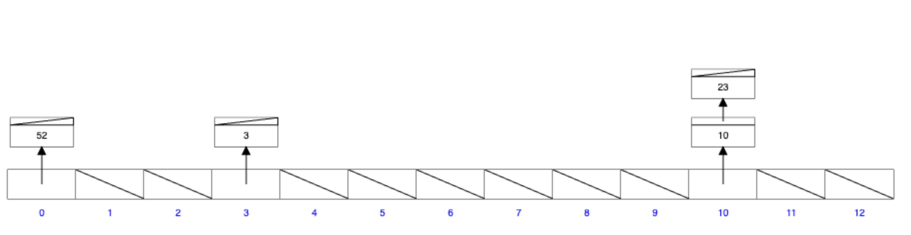

### hash table

1. md5 Hash Table [https://www.miraclesalad.com/webtools/md5.php]

2. Hash Table memory animation [https://www.cs.usfca.edu/~galles/visualization/OpenHash.html]

3. Hash Table wiki [https://en.wikipedia.org/wiki/Hash_table]

Hash functions  
    - a same value and the same hash value  
    - cannot retrieve the value from the hash value
    

Collusion :  
    - different value but have the same hash value
    - how to solve the collision problem
    

### Script

